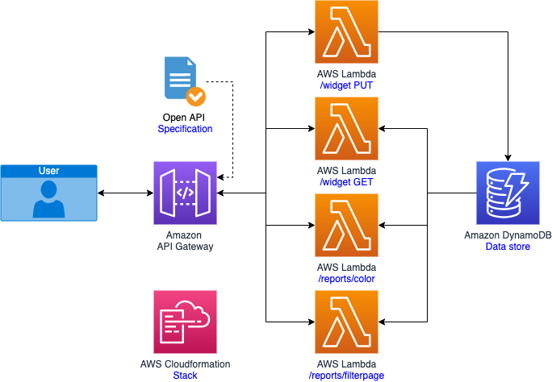
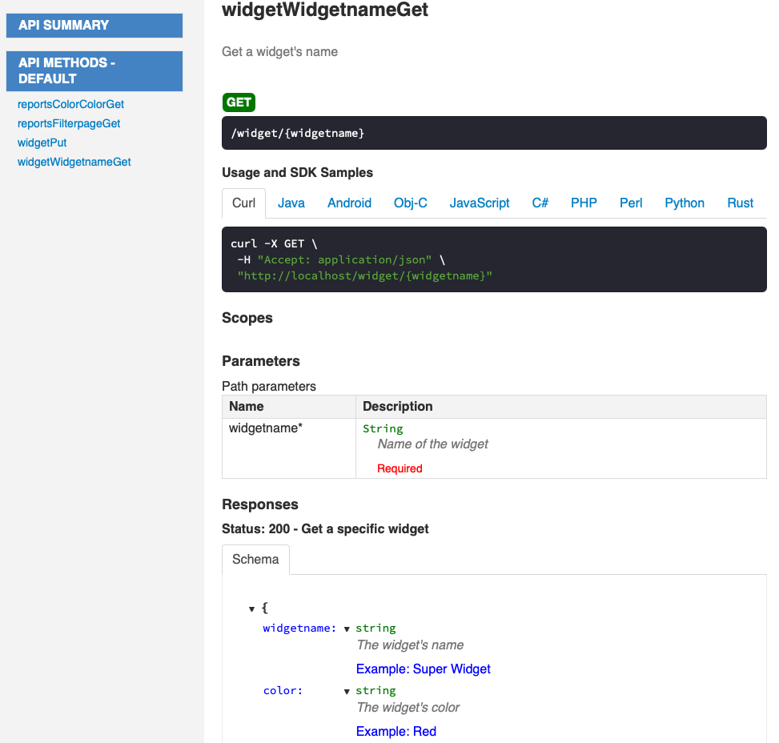

# Service Creation API Integration Demo

## Demo Project Overview

The project is the API back-end for a widget tracking website.  Widget tracking is simplistic - widgets have only an unique name and a color descriptor for properties.  The Database is Dynamo DB, and several API endpoint service the widget front end:
* /widget [PUT] - Add or Update a widget
* /widget/{widgetName} [GET] - Retrieve a specific widget
* /reports/color [GET] - Return all the widgets in the database of a given color
* /reports/filterpage [GET] - List of widgets with pagination support, limits, and color query

### Architecture Diagram:


* Amazon API Gateway is a fully managed service that makes it easy for developers to create, publish, 
  maintain, monitor, and secure APIs at any scale.  In this example, API Gateway serves as the web service
  for the API endpoints.  The mapping of data to and from the API endpoints to the lambda functions is
  formally defined by an OpenAPI specification file.
* AWS Lambda is a serverless compute service that lets you run code without provisioning or managing servers, creating 
  workload-aware cluster scaling logic, maintaining event integrations, or managing runtimes. 
  In this example, 4 Lambda functions are used to service each of the 4 API calls
* Amazon DynamoDB is a key-value and document database that delivers single-digit millisecond performance
  at any scale. DynamoDB is used as a persistent data store for widgets and associated properties.
---

## Setup, Test, and Build

This project uses a [Makefile](Makefile) with the build and setup commands.  Note that sudo may be required for the setup command.

* ```make setup```: (May require sudo) Create a python environment and install dependencies
* ```make deploy STACKNAME=<YourStackName> BUCKETNAME=<YourBucketName```: (Default) Build and deploy the application
* ```make buildOpenApi```: Compile the OpenAPI specification to /api/api.yaml
* ```make generateApiDoc```: Compile the OpenAPI specification to /api/api.yaml and generate the documentation to apidocs/index.html
* ```make buildTemplate```: Compile the CloudFormation specification to template.yaml
* ```make packageOnly```: SAM build and package.  Use for CodeBuild buildspec.yaml build stage.
* ```make activate```: Activate the python environment
* ```make pyTest```: Run python unit tests
* ```make coverage```: Run python unit tests with coverage analysis and report
* ```make coverageHtml```: Run python unit tests with coverage analysis and report in HTML
* ```make testAll```: Run python test coverage, bandit vulnerability scanning, API validation, Cloudformation cfs-nag test
  
---

## Project Organization

---

As the project code base grows and multiple developers contribute, code and file organization becomes paramount 
for navigating the code and preventing merge conflicts.  The directory structure reflects the main assets 
(api, pylambda, cloudformation, tests), and further sub-directories are organized by the API endpoints serviced 
by the code they contain. ("lambda" is a keyword in python, necessitating the directory name "pylambda".)
```shell
.
├── api
│   ├── gatewayResponses
│   ├── paths
│   │   ├── reports
│   │   └── widget
│   └── schemas
├── apidocs
├── cloudformation
│   └── resources
│       ├── apigw
│       ├── dynamodb
│       └── lambda
│           ├── layers
│           ├── reports
│           └── widget
├── pylambda
│   ├── layers
│   │   ├── lambdaDdbEnv
│   │   │   └── python
│   ├── reports
│   │   ├── color
│   │   └── filterpage
│   └── widget
│       ├── get
│       └── put
├── sample
└── tests
    ├── layers
    ├── reports
    └── widget
```
Two files in particular often become large and unmanageable: the OpenAPI specification
and the CloudFormation template.

---
### OpenAPI YAML organization

This project demonstrates one technique for maintaining the OpenAPI specification and CloudFormation script by breaking
it into individual endpoints, responses, and schemas.  This necessitates and additional "compile" step to reconstitute
the openAPI spec into a complete singleton for deployment, but with automated CICD pipelines, the organizational 
benefit outweighs this extra compilation step.

The openAPI entry point is [api/apiSkeleton.yaml](api/apiSkeleton.yaml), which contains the global definitions and 
effectively a clean list of endpoints.  Each endpoint includes a $ref to the endpoint specification:
```yaml
  /reports/color:
    $ref: './paths/reports/reportsColor.yaml'
```
In turn, each of the endpoint specifications have $ref inclusions for schemas and responses.  For example, a 200 response
returning a widgetList schema would be specified as follows (note $ref):
```yaml
  responses:
    200:
      description: Get All The Widgets of a color
      content:
        application/json:
          schema:
            $ref: '../../schemas/widgetList.yaml'
```
The consolidated ```api/api.yaml``` file is compiled with the swagger-cli, and must be executed before a 
cloudformation/SAM build.  This command is also in the [Makefile](Makefile) as "buildOpenApi".
```shell
swagger-cli bundle -o api/api.yaml --dereference --t yaml  api/apiSkeleton.yaml
```
or
```shell
make buildOpenApi
```
Once compiled, `api/api.yaml` is then used for API Gateway integrations and as a PostMan API Collection import.  As
`api/api.yaml` is dynamically compiled, it is included in [.gitignore](.gitignore) and not checked in to CodeCommit.

---
### Generating the OpenApi documentation

The documentation for the different API end points can be automatically generated based on the Open Api YAML file
using:

```shell
openapi-generator generate -i api/api.yaml -g html2 -o ./apidocs
```
or to generate the api.yaml file and create the documentation:

```shell
make generateApiDoc
```

The generated documentation contains information about each API (parameters, responses, etc..) as well as 
sample stubs on how to consume each API in different programming languages. This screenshot below shows a
portion of the generated documentation.



---
### Cloudformation / SAM template organization


Similar to the OpenAPI specification, the SAM/Cloudformation template can grow lengthy and become a source of merge conflicts.  While
there are other approaches, such as child stacks, this demo uses cfn-include.  The SAM template is deconstructed into
one file per resource, with a entry point of [cloudformation/templateSkeleton.yaml](cloudformation/templateSkeleton.yaml).
This skeleton contains the parameters, globals, conditions, and output specification.  The resources are specified with the
resource name, and then an include directive to the body of the resource declaration:
```yaml
Resources:
  WidgetApi:
    !Include ./resources/apigw/widgetApiGw.yaml
  widgetDdbTable:
    !Include ./resources/dynamodb/widgetDdbTable.yaml
```
The files will need to be reconstituted to a single template.yaml for build and deployment.  This is accomplished with the
```cfn-include``` command.  A convenience command is also included in the [Makefile](Makefile).  

```shell
  cfn-include --yaml  cloudFormation/templateSkeleton.yaml > template.yaml
```
or
```shell
  make buildTemplate
```
As `template.yaml` is dynamically compiled, it is included in [.getignore](.getignore) and not checked in to CodeCommit.

---


## API Gateway Integration

---

Leveraging OpenAPI specification integration with API gateway has several advantages:

* It provides a vehicle for design of API endpoints.
* Endpoints can provide mocked data until they are implemented.
* It provides clear documentation and PostMan configuration, serving as a specification for both lambda development 
  and UI development.

The OpenAPI spec is integrated into the SAM template in the following manner.  This specification is in addition to 
the standard ApiEvent.Properties.Path parameter in each the lambda SAM resource.  The same api.yaml file is used as 
input to the SAM script, PostMan configuration, and documentation.

To establish the OpenAPI configuration for API Gateway, use the API Gateway DefinitionBody property.  See example
[cloudformation/resources/apigw/widgetApiGw.yaml](cloudformation/resources/apigw/widgetApiGw.yaml):
```yaml
      DefinitionBody:
        Fn::Transform:
          Name: AWS::Include
          Parameters:
            Location: api/api.yaml
```

---

### Path variables

To pass a variable to a lambda function, map $method.request.path to keys that will be passed to the `event`
in the python lambda handler.  For example, to pass `"`widgetName`"` from the api path `widget/{widgetName}` into 
`event["widgetName"]`, it is specified by $method.request.path.widgetName in the request template.
Example: [api/paths/widget/widgetWIdGetNameGet.yaml](api/paths/widget/widgetWIdGetNameGet.yaml)
```yaml
  x-amazon-apigateway-integration:
    requestTemplates:
      "application/json": |
        { "widgetName": "$method.request.path.widgetName" }
```

---

### Query parameters

To pass a query parameter to a lambda function, map $method.request.querystring to keys that will be passed to the 
`event` in the python lambda handler.  For example, to pass `"`lastKey`"` from the api path `widget/?lastKey=hi` into
`event["lastKey"]`, it is specified by $method.request.querystring.lastKey in the request template.
Example: [api/paths/reports/reportsFilterPage.yaml](api/paths/reports/reportsFilterPage.yaml)
```yaml
    requestTemplates:
      "application/json": |
        #set ($root=$input.path('$'))
        { "limit": "$method.request.querystring.limit",
          "lastKey": "$method.request.querystring.lastKey",
          "filter": "$method.request.querystring.filter"
        }
```

---

### PUT / Body Data

Example [api/paths/widget/widgetPut.yaml](api/paths/widget/widgetPut.yaml). \
The body of a PUT command is defined a schema, in this example {widgetName, color} as defined in 
[api/schemas/widget.yaml](api/schemas/widget.yaml).
```yaml
  requestBody:
    required: true
    content:
      application/json:
        schema:
          $ref: '../../schemas/widget.yaml'
```
The members of the schema may ba accessed directly from the path root `$`:
```yaml
    requestTemplates:
      "application/json": |
          #set($inputRoot = $input.path('$'))
          {
            "widgetName" : "$inputRoot.widgetName",
            "color" : "$inputRoot.color"
          }
```

---

### Returning data

With direct integration method, the API response format and return code is defined in the OpenAPI
specification.  The python lambda handler only need directly return the list or dictionary of 
designed data for 200 returns.  For error conditions, the python code should raise an error with
a descriptive error message.  This message is than pattern matched in the OpenAPI specification to
determine the return value and format for the message.  In this example, a "NotFound" error from
python triggers a pattern match to `NotFound.*`, which leverages the gatewayResponses/notFound.yaml
definition of 400 and an error message return.  
\
Example:
* [pylambda/reports/color/app.py](pylambda/reports/color/app.py)
* [api/paths/reports/reportsColor.yaml](api/paths/reports/reportsColor.yaml) 

Python Lambda Handler:
```python
        # Raise NotFound if return is 0
        if len(widget_list) == 0:
            raise Exception("NotFound: no data matching query")
```
OpenAPI pattern match NotFound.*:
```yaml
    responses:
      default:
          ...
      NotFound.*:
        $ref: "../../gatewayResponses/notFound.yaml"
```
Gateway response notFound (../../gatewayResponses/notFound.yaml):
```yaml
statusCode: "400"
responseTemplates:
  application/json: "#set ($root=$input.path('$')) \"Error\": \"$root.errorMessage\" "
  text/*: "#set ($root=$input.path('$')) \"Error\": \"$root.errorMessage\" "
```

---
## Other Python & DynamoDB Examples

---
### No data found : return 4xx

When a query returns no data, detect the lack of return data and raise a "NotFound" error.
* [pylambda/reports/color/app.py](pylambda/reports/color/app.py)
* [api/paths/reports/reportsColor.yaml](api/paths/reports/reportsColor.yaml)
  
---

### Global Variables and AWS Service connections

Placing environment and AWS service connections in global variables can optimize lambda execution
environments, but can make unit tests difficult.  One approach is to create a global container 
class, which can be mocked in the unit tests.  Additionally, the logic for the lambda should be moved to a separate
function, and the lambda_hander passes both the event dictionary and the global environment to this
separate function.

```python
GLOBAL_ENV = EnvParams()

def lambda_handler(event: dict, context: Any) -> dict:
 
   # One try-except block in lambda_handler for all AWS service calls
  try:
    return get_ddb_data(event, GLOBAL_ENV)
  
  except ClientError as client_error:
    raise Exception("error: Internal Server Error") from client_error
```

This pattern will allow you to mock the global environment easier, and also pass a mocked environment to
the other function.  For an example of this, see [pylambda/reports/color/app.py](pylambda/reports/color/app.py)
and test [tests/reports/color/test_color.py](tests/reports/color/test_color.py).

---

###  DynamoDB List Pagination

Even if a returned list of items is expected to be small, paginate your dynamodb output.  Furthermore,
explicitly code a limit so that the pagination logic may be tested in unit test. 
Example: [pylambda/reports/color/app.py](pylambda/reports/color/app.py), `get_ddb_data()`

---

### The Web paging / scrolling pattern

Web UI's may not be able to consume a full list of items, and a common practice is to limit the
number of items returned as well as provide for "previous" and "next" page return.  This pattern
is demonstrated in the [reports/filterpage](pylambda/reports/filterPage/app.py) endpoint.

---

### Dynamic Dynamo DB queries

An endpoint may have flexibility to specify optional query parameters.  Coding each possible case
and condition can become complex.  The example 
[pylambda/reports/filterpage/app.py](pylambda/reports/filterPage/app.py) dynamically builds the 
DDB query using a `scan_kwargs` dictionary:
```python
        # Client requests an option for filtering on widget name
        if "filter" in event.keys() and len(event["filter"]) > 0:
            scan_kwargs["FilterExpression"] = 'contains(#S, :s)'
            scan_kwargs["ExpressionAttributeNames"] = {"#S": ENV.ddb_pk}
            scan_kwargs["ExpressionAttributeValues"] = {":s": event["filter"]}

        # Client has specified a pagination start
        if "lastkey" in event.keys() and len(event["lastkey"]) > 0:
            scan_kwargs["ExclusiveStartKey"] = {ENV.ddb_pk: event["lastkey"]}

        # Execute the query
        response = env.ddb_table.scan(**scan_kwargs)
```

---

### 100% Unit test coverage

The unit test [tests/reports/test_color.py](tests/reports/test_color.py) provides 100% test coverage
of [pylambda/reports/color/app.py](pylambda/reports/color/app.py) through the following techniques:
* The global environment is kept in a container class in the global ENV, which is more easily mocked and controlled.
* The DynamoDB query is in a separate function get_ddb_data, apart from from lambda_handler, 
  allowing get_ddb_data to be mocked and the simulation of DDB exception events.

---

### Lambda Layer module include

The lambda layer [pylambda/layers/lambdaDdbEnv/python/lambdaDdbEnvLayer.py](pylambda/layers/lambdaDdbEnv/python/lambdaDdbEnvLayer.py)
is used on all of the lambda handlers.  You may note the additional subdirectory "python", which
places the module in the proper place to be imported.
```python
from lambdaDdbEnvLayer import EnvParams
```
To unit test a lambda handler that imports a lambda layer, you can setup an include path in the 
test code before import:

```python
from sys import path

# Set up lambda layer directories to support imports
path.extend(["pylambda/layers/lambdaDdbEnv/python"])

# Class/proc's under test import
from pylambda.reports.color.app import lambda_handler
```

---

### Building Python Projects in CodeBuild

During a SAM build and package, there could be multiple copies of template.yaml in play.  Once copy does
not properly reference the packaged python lambdas, and may cause requirements to not be deployed.
In the below example:
* template.yaml is the specification for `sam build`
* .aws-sam/build/template.yaml is created by `sam build`, and used as input to `sam package`

```shell
	swagger-cli bundle -o api/api.yaml --dereference --t yaml  api/apiSkeleton.yaml
	cfn-include --yaml  cloudFormation/templateSkeleton.yaml > template.yaml
	sam build --parallel && sam package --template-file .aws-sam/build/template.yaml --s3-bucket wrap-vr-ci-cd --output-template-file packaged.yaml --no-progressbar
	echo "Output Build Asset: packaged.yaml"
```

---

### Full testing Suite
```shell
	coverage run -m unittest discover
	coverage report -m --omit ".venv/*","tests/*"
	bandit -r . -c bandit.yaml -f txt
	swagger-cli validate api/api.yaml
	cfn_nag_scan --input-path template.yaml
```

Note that some bandit versions will not handle folder excludes properly, in which case the third line above 
could be replaced with:

```shell
    bandit -r  . -x ".venv,.aws-sam,venv" -s "B101" -f txt
```


